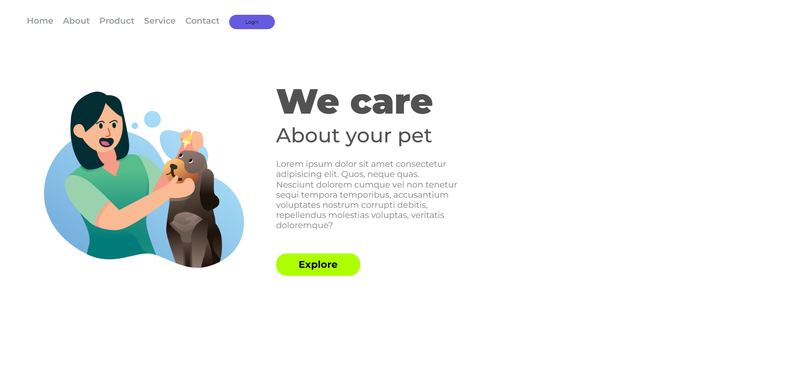

# We Care - Landing Page para Cuidado de Pets

Este projeto é uma landing page simples, mas elegante, para um serviço de cuidado de pets. Ele foi desenvolvido usando HTML e CSS, com foco em design responsivo para funcionar bem em diferentes dispositivos.

## Conteúdo

* [Visão Geral](#visão-geral)
* [Funcionalidades](#funcionalidades)
* [Tecnologias Utilizadas](#tecnologias-utilizadas)
* [Como Executar](#como-executar)
* [Estrutura do Projeto](#estrutura-do-projeto)
* [Melhorias Futuras](#melhorias-futuras)
* [Autor](#autor)

## Visão Geral

A landing page "We Care" tem como objetivo apresentar um serviço de cuidado de pets de forma clara e atraente. Ela inclui uma imagem ilustrativa, um título impactante, uma breve descrição e um botão de chamada para ação.

## Funcionalidades

* **Design Responsivo**: A página se adapta a diferentes tamanhos de tela, garantindo uma boa experiência em dispositivos móveis e desktops.
* **Layout Limpo e Atraente**: Utilização de cores e tipografia que transmitem profissionalismo e cuidado.
* **Navegação Simples**: Menu de navegação claro e intuitivo (oculto em telas menores).
* **Chamada para Ação**: Botão "Explore" para incentivar o usuário a interagir com o serviço.

## Tecnologias Utilizadas

* **HTML**: Estrutura da página.
* **CSS**: Estilos e layout da página.
* **Google Fonts**: Fontes personalizadas (Montserrat).

## Como Executar

1.  Clone o repositório ou baixe os arquivos do projeto.
2.  Abra o arquivo `index.html` em seu navegador web.

## Estrutura do Projeto

* `index.html`: Arquivo HTML principal da landing page.
* `styles.css`: Arquivo CSS com os estilos da página.
* `img/Illustration 2.png`: Imagem ilustrativa do projeto.

## Melhorias Futuras

* **Adicionar Interatividade**: Incluir animações ou efeitos visuais para tornar a página mais dinâmica.
* **Melhorar o Conteúdo**: Adicionar informações mais detalhadas sobre os serviços oferecidos.
* **Implementar Formulário de Contato**: Permitir que os usuários entrem em contato diretamente pela página.
* **Otimizar para SEO**: Melhorar a otimização para mecanismos de busca.
* **Adicionar mais breakpoints**: O projeto tem apenas um breakpoint, sendo interessante adicionar mais para melhor adaptação em diversos dispositivos.
* **Adicionar Footer**: Um footer com informações de contato, redes sociais e links úteis pode melhorar a experiência do usuário.
* **Adicionar favicon**: Um favicon ajuda a identificar seu site nas abas do navegador.

## Visualização do projeto

